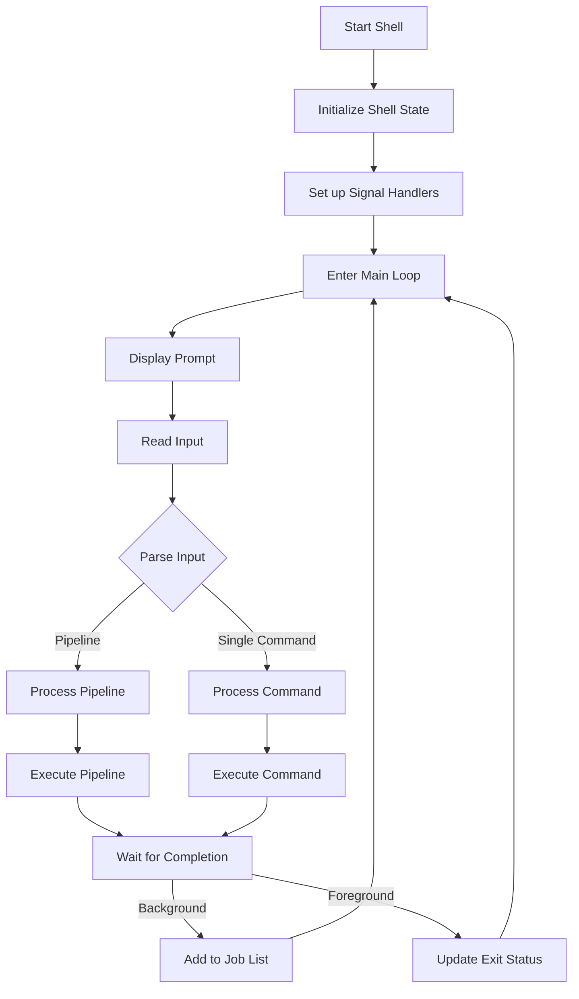

# Shell Execution Flow

## Overview

BeaudyShell follows a clear execution flow for processing commands:

## Detailed Flow

1. **Shell Initialization**
   - Set up shell state
   - Initialize job control
   - Configure signal handlers
   - Set up terminal attributes

2. **Command Processing**
   - Read user input
   - Parse into commands/pipelines
   - Handle redirections
   - Process built-in commands
   - Execute external commands

3. **Pipeline Handling**
   - Create pipes between commands
   - Fork processes for each command
   - Set up process groups
   - Handle I/O redirections
   - Execute commands in pipeline

4. **Job Control**
   - Manage background processes
   - Handle process groups
   - Process signals (SIGCHLD, SIGINT, etc.)
   - Support job control commands (fg, bg, jobs)

5. **Signal Handling**
   - SIGCHLD: Child process status changes
   - SIGINT: Interrupt (Ctrl+C)
   - SIGTSTP: Stop (Ctrl+Z)
   - SIGQUIT: Quit (Ctrl+\)

6. **Built-in Commands**
   - cd: Change directory
   - pwd: Print working directory
   - jobs: List jobs
   - fg: Bring to foreground
   - bg: Continue in background
   - exit: Exit shell

## Error Handling

- Command not found
- Permission denied
- Pipeline setup failures
- Signal handling errors
- Job control issues
